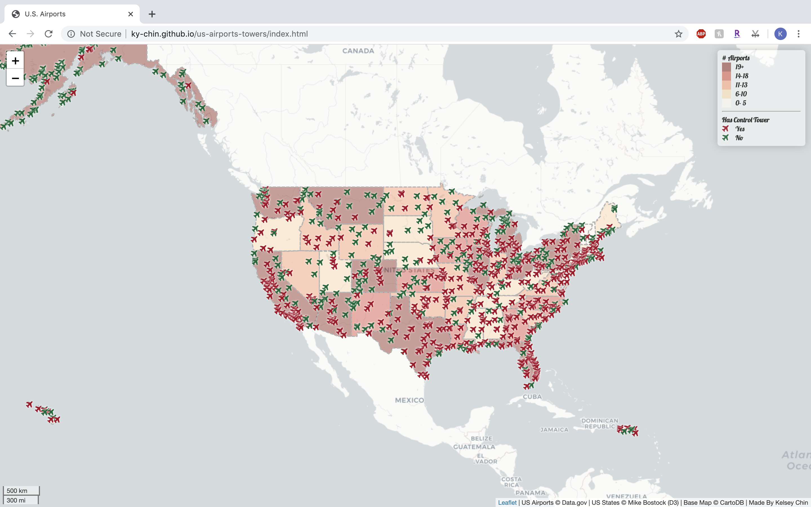
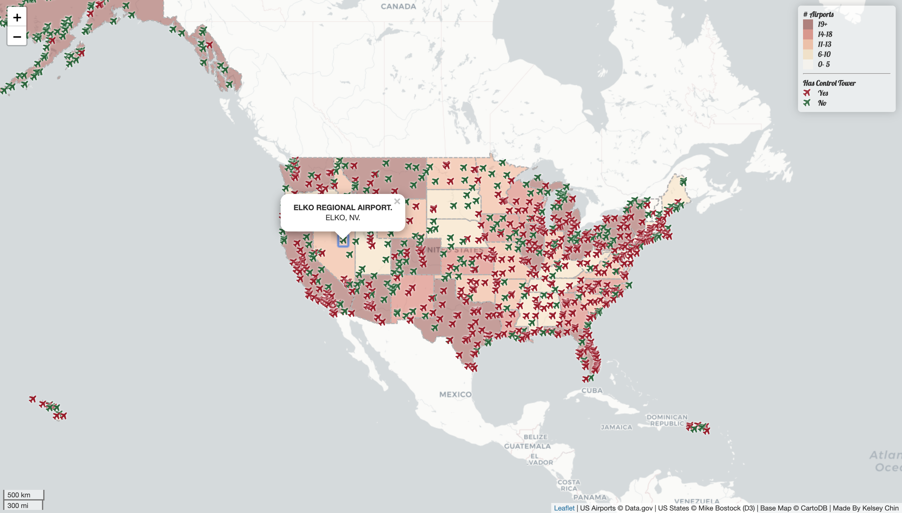

# United States Airports
Kelsey Chin, 2020.
University of Washington, Seattle.
Advanced Digital Geographies.

***

This map is a display of the airports in the United States as of 2012. States display relative counts of airports, and airports themselves are categorized by whether or not they have a control tower. A popup for each airport displays basic information such as the name and location.

#### Sources
- Basemap by CartoDB.
- Airport data sourced from [`data.gov`](https://catalog.data.gov/dataset/usgs-small-scale-dataset-airports-of-the-united-states-201207-shapefile).
- United States state boundary data from Mike Bostock of D3.

#### Libraries
- [leaflet.ajax](https://github.com/calvinmetcalf/leaflet-ajax)
- [Font Awesome](http://fontawesome.io/)
- [Chroma.js](https://gka.github.io/chroma.js/)
